## System Overview

```mermaid
graph TD

    subgraph BusinessLayer["Businesses / Merchants"]
        A["Accept Crypto Payments"] --> B["No Dependence on Central Processor"]
    end

    subgraph AILayer["OLAS AI Agents Network"]
        C["Autonomous Agents"] --> D["Consensus Validation"]
        D --> E["Collective Decision Making"]
        E --> F["Trustless Payment Settlement"]
    end

    subgraph InfraLayer["Decentralized Infrastructure"]
        G["Tendermint Consensus"]
        H["IPFS Storage"]
        I["Blockchain Settlement"]
    end

    B -->|Delegates to| C
    F -->|Stores Records| H
    F -->|Verifies Payments On| I
    C -->|Coordinates via| G

    %% Visual grouping
    style BusinessLayer fill:#fffbea,stroke:#999,stroke-width:1px
    style AILayer fill:#e8f5e9,stroke:#999,stroke-width:1px
    style InfraLayer fill:#e3f2fd,stroke:#999,stroke-width:1px

    %% Highlight benefits in yellow boxes
    L1["🟡 Eliminates Single Points of Failure"]
    L2["🟡 AI Agents Automate Payment Operations"]
    L3["🟡 Consensus + IPFS Guarantee Transparency & Resilience"]

    L1 -.-> G
    L2 -.-> C
    L3 -.-> H

```




<details>

<summary>How it works?</summary>

### Detect invoices


### Verify on blockchain


### Confirm + record transparently

Let the company know about the result (through `webhook`).


</details>

<details>
<summary>Development</summary>

## System requirements

- Python `>=3.10`
- [Tendermint](https://docs.tendermint.com/v0.34/introduction/install.html) `==0.34.19`
- [IPFS node](https://docs.ipfs.io/install/command-line/#official-distributions) `==0.6.0`
- [Pip](https://pip.pypa.io/en/stable/installation/)
- [Poetry](https://python-poetry.org/)
- [Docker Engine](https://docs.docker.com/engine/install/)
- [Docker Compose](https://docs.docker.com/compose/install/)
- [Set Docker permissions so you can run containers as non-root user](https://docs.docker.com/engine/install/linux-postinstall/)

## Run you own agent

### Get the code

1. Clone this repo:

   ```
   git clone --depth 1 https://github.com/miladtsx/academy-learning-agent-service

   ```

2. Create the virtual environment:

   ```
   cd academy-learning-service
   poetry shell
   poetry install
   ```

3. Sync packages:

   ```
   autonomy packages sync --update-packages
   ```

### Prepare the data

1. Prepare a keys.json file containing wallet address and the private key for each of the four agents.

   ```
   autonomy generate-key ethereum -n 4
   ```

2. Prepare a `ethereum_private_key.txt` file containing one of the private keys from `keys.json`. Ensure that there is no newline at the end.

3. Create a [Tenderly](https://tenderly.co/) account and from your dashboard create a fork of ETHEREUM chain (virtual testnet).

4. From Tenderly, fund your agents and Safe with some ETH and USDC (`0xa0b86991c6218b36c1d19d4a2e9eb0ce3606eb48`).

5. Make a copy of the env file:

   ```
   cp sample.env .env
   ```

6. Fill in the required environment variables in .env. These variables are:

- `ALL_PARTICIPANTS`: a list of your agent addresses. This will vary depending on whether you are running a single agent (`run_agent.sh` script) or the whole 4-agent service (`run_service.sh`)
- `GNOSIS_LEDGER_RPC`: set it to your Tenderly fork Admin RPC.

### Run a single agent locally

1. Verify that `ALL_PARTICIPANTS` in `.env` contains only 1 address.

2. Run the agent:

   ```
   bash run_agent.sh
   ```

### Run the service (4 agents) via Docker Compose deployment

1. Verify that `ALL_PARTICIPANTS` in `.env` contains 4 address.

2. Check that Docker is running:

   ```
   docker
   ```

3. Run the service:

   ```
   bash run_service.sh
   ```

4. Look at the service logs for one of the agents (on another terminal):

   ```
   docker logs -f learningservice_abci_0
   ```
</details>

---
[SRS Document](https://docs.google.com/document/d/1KC4O3u80VcUfUFCL4joMqhe22K09v7dChJSlvPrj4jQ/)